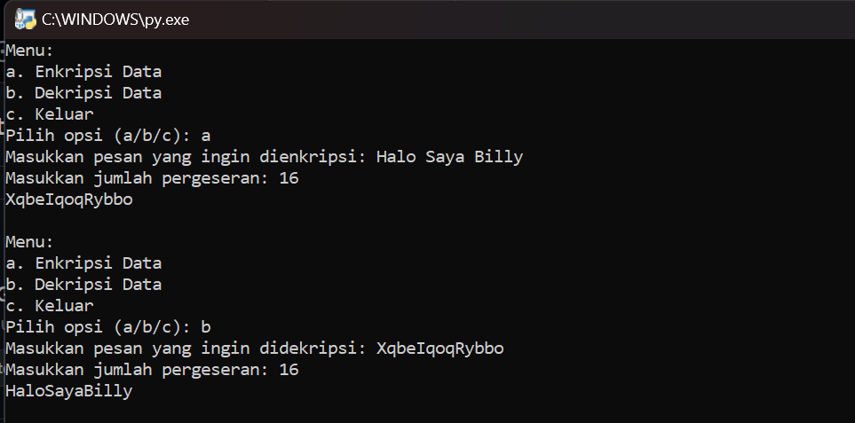

# Kriptografi
# Caesar Chiper
## Enkripsi-Dekripsi
<body>
    <table border="1">
        <tr>
            <th> Nama</th>
            <th>NIM</th>
            <th>Kelas</th>
        </tr>
        <tr>
            <td>Billy Alfauzi Caesar</td>
            <td>312110152</td>
            <td>TI.21.A.1</td>
        </tr>
    </table>
</body>

## Penjelasan
Sedikit Informasi pada kode Enkrip-Dekrip caesar chiper ini.
1. Fungsi ***encrypt_caesar_cipher(text, shift):***

- Digunakan untuk mengenkripsi teks menggunakan metode Caesar Cipher dengan pergeseran sebesar (shift).
- ***encrypted_text*** digunakan untuk menyimpan hasil enkripsi.
- Loop ***for*** digunakan untuk mengiterasi melalui setiap karakter dalam teks input.
- ***if char.isalpha():*** digunakan untuk memeriksa apakah karakter adalah huruf.
- ***is_upper*** digunakan untuk menyimpan informasi apakah karakter tersebut adalah huruf besar (uppercase).
- Karakter diubah menjadi huruf kecil (lowercase) menggunakan ***char.lower()***
- Proses pergeseran karakter dilakukan dengan menghitung nilai ordinal karakter, menambahkan shift, kemudian mengonversinya kembali menjadi karakter.
- Karakter yang diubah dikembalikan ke huruf besar (uppercase) jika awalnya adalah huruf besar.
- Dan Karakter yang tidak berupa huruf (seperti spasi, tanda baca, atau angka) tidak diubah.
- Hasil enkripsi ditambahkan ke dalam encrypted_text.

2. Fungsi ***decrypt_caesar_cipher(text, shift):***

- Fungsi ini digunakan untuk mendekripsi teks menggunakan metode Caesar Cipher dengan pergeseran sebesar shift, yang sebenarnya sama dengan enkripsi dengan pergeseran ke arah yang berlawanan. 
- Fungsi ini memanggil ***encrypt_caesar_cipher*** dengan nilai pergeseran negatif untuk mendekripsi teks.

3. Fungsi ***main():***

- Fungsi ini adalah program utama yang digunakan untuk interaksi dengan pengguna.
- Pengguna diberikan tiga opsi: enkripsi, dekripsi, atau keluar dari program.
- Jika pengguna memilih untuk mengenkripsi **(choice == 'a')**, mereka diminta memasukkan teks yang akan dienkripsi dan jumlah shift.
- Spasi dalam teks dihapus sebelum proses enkripsi agar hanya karakter huruf yang dienkripsi.
- Hasil enkripsi ditampilkan.
- Jika pengguna memilih untuk mendekripsi **(choice == 'b')**, mereka diminta memasukkan teks yang akan didekripsi dan jumlah pergeseran.
- Hasil dekripsi ditampilkan.
- Jika pengguna memilih untuk keluar **(choice == 'c')**, maka pengguna diarahkan untuk langsung keluar.

# Output

## Done

# Panjang Umur Untuk Semua Hal-Hal Baik